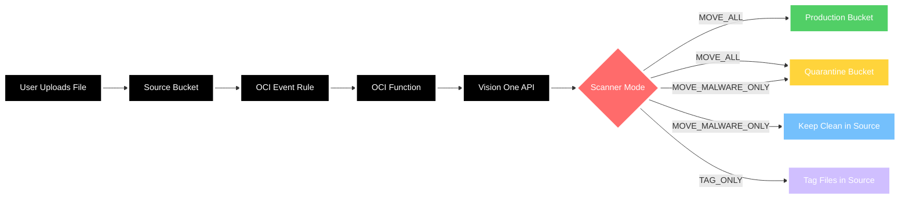

# Vision One File Security Scanner for OCI

Automated file security scanning solution for Oracle Cloud Infrastructure (OCI) using Trend Micro Vision One File Security SDK. Files uploaded to a source bucket are automatically scanned for malware and moved to appropriate buckets based on scan results.

## Architecture



**Components:**
- **Source Bucket**: Files uploaded here trigger automatic scanning
- **OCI Event Rule**: Detects file uploads and triggers the function
- **OCI Function**: Downloads, scans, and routes files based on scanner mode
- **Vision One API**: Performs malware scanning using advanced threat detection
- **Scanner Mode**: Configurable behavior for file processing (MOVE_ALL, MOVE_MALWARE_ONLY, TAG_ONLY)
- **Production Bucket**: Clean files destination (MOVE_ALL mode only)
- **Quarantine Bucket**: Malware files isolation (MOVE_ALL and MOVE_MALWARE_ONLY modes)

## Prerequisites

### Required Tools
- [Terraform](https://www.terraform.io/downloads.html) >= 1.0
- [Docker](https://docs.docker.com/get-docker/)
- [OCI CLI](https://docs.oracle.com/en-us/iaas/Content/API/SDKDocs/cliinstall.htm)

### OCI Resources
- OCI Tenancy with appropriate permissions
- Compartment for deploying resources
- VCN with subnet for function deployment
- Object Storage buckets (requirements vary by scanner mode):
  - **Source bucket** (required for all modes): Where files are uploaded
  - **Production bucket** (required for MOVE_ALL mode): For clean files
  - **Quarantine bucket** (required for MOVE_ALL and MOVE_MALWARE_ONLY modes): For files with malware

**Note**: Bucket requirements depend on your chosen scanner mode. See Scanner Modes section for details.

### Vision One Requirements
- Trend Micro Vision One account
- Vision One API key with "Run file scan via SDK" permission
- Vision One region (e.g., ap-southeast-2)

### OCI Vault Setup 
Setup OCI Vault to store Vision One API Key credentials:

1. **Create a Vault** (if not already available):
   ```bash
   oci kms management vault create \
     --compartment-id <compartment-ocid> \
     --display-name "v1-fss-vault" \
     --vault-type DEFAULT
   ```

2. **Create a Master Encryption Key**:
   ```bash
   oci kms management key create \
     --compartment-id <compartment-ocid> \
     --display-name "v1-fss-key" \
     --key-shape '{"algorithm":"AES","length":32}' \
     --endpoint <vault-management-endpoint>
   ```

3. **Create a Secret for Vision One API Key**:
   ```bash
   oci vault secret create-base64 \
     --compartment-id <compartment-ocid> \
     --secret-name "vision-one-api-key" \
     --vault-id <vault-ocid> \
     --key-id <key-ocid> \
     --secret-content-content <base64-encoded-api-key>
   ```

4. **Note the Secret OCID** for use in terraform.tfvars

5. **Emit object events is enabled for the bucket to be scanned**

   Go to the bucket details enable Emit object events if it is disabled

## Quick Start

### 1. Configure Terraform Variables

Copy and edit the configuration file:

```bash
cp terraform/terraform.tfvars.example terraform/terraform.tfvars
```

Edit `terraform/terraform.tfvars` with your values:

```hcl
# OCI Authentication
tenancy_ocid     = "ocid1.tenancy.oc1..aaaaaaaa..."
user_ocid        = "ocid1.user.oc1..aaaaaaaa..."
fingerprint      = "aa:bb:cc:dd:ee:ff:gg:hh:ii:jj:kk:ll:mm:nn:oo:pp"
private_key_path = "~/.oci/oci_api_key.pem"
region           = "ap-sydney-1"

# Compartment and Network
compartment_id = "ocid1.compartment.oc1..aaaaaaaa..."
subnet_id      = "ocid1.subnet.oc1.ap-sydney-1.aaaaaaaa..."

# Existing Bucket Names
source_bucket_name      = "your-source-bucket"
production_bucket_name  = "your-production-bucket"
quarantine_bucket_name  = "your-quarantine-bucket"

# Vision One Configuration (using OCI Vault)
vision_one_api_key_secret_ocid = "ocid1.vaultsecret.oc1.ap-sydney-1.aaaaaaaa..."
vision_one_region = "ap-southeast-2"
v1_scanner_endpoint = "<scanner-endpoint>:50051"

# Scanner Mode Configuration
v1_file_scanner_mode = "MOVE_ALL"  # Options: MOVE_ALL, MOVE_MALWARE_ONLY, TAG_ONLY

# Docker/OCIR Configuration
docker_username = "your-tenancy-namespace/your-username"
docker_auth_token = "your-oci-auth-token"
ocir_region = "syd.ocir.io"
```

## Scanner Modes

The scanner supports three operating modes to control how files are processed after scanning:

### MOVE_ALL (Default)
- **Clean files**: Moved to production bucket
- **Infected files**: Moved to quarantine bucket
- **Best for**: Production environments requiring complete file separation

### MOVE_MALWARE_ONLY
- **Clean files**: Remain in source bucket with scan metadata
- **Infected files**: Moved to quarantine bucket
- **Best for**: Development environments and cost optimization

### TAG_ONLY
- **All files**: Remain in source bucket with scan metadata
- **Best for**: Audit scenarios and external security tool integration

**Configuration**: Set `v1_file_scanner_mode` in terraform.tfvars to your preferred mode.

### 2. Deploy

The deployment script has been optimized for ease of use with enhanced safety features:

```bash
# Deploy infrastructure (default operation)
./deploy.sh

# Or explicitly specify deploy
./deploy.sh deploy
```

### 3. Manage Infrastructure

```bash
# Deploy infrastructure
./deploy.sh deploy

# Destroy infrastructure with safety confirmations
./deploy.sh destroy

# Destroy infrastructure without prompts (automated)
./deploy.sh destroy --force

# Get help
./deploy.sh help
```

The deployment script automatically:
- ✅ Checks prerequisites (Terraform, Docker, OCI CLI)
- ✅ Validates Docker daemon is running
- ✅ Verifies Terraform configuration exists
- ✅ Warns about placeholder values in configuration
- ✅ Provides colored output for better visibility
- ✅ Shows deployment summary with resource details
- ✅ Includes safety confirmations for destroy operations

## What Gets Created

- **OCIR Repository** - Container registry for the function image
- **Function Application** - OCI Functions application with GENERIC_X86 shape
- **Function** - The malware scanning function
- **Event Rule** - Triggers function on object uploads to source bucket
- **Dynamic Group & IAM Policy** - Permissions for function execution
- **Log Group & Logs** - Logging for events and function execution

## How It Works

1. **File Upload** → User uploads file to source bucket
2. **Event Trigger** → OCI Events detects upload and triggers function
3. **File Download** → Function downloads file to temporary storage
4. **Malware Scan** → File scanned using Vision One File Security SDK
5. **Result Processing** → Based on scanner mode and scan results:
   - **MOVE_ALL mode**: Clean files → production bucket, malware → quarantine bucket
   - **MOVE_MALWARE_ONLY mode**: Clean files → remain in source bucket, malware → quarantine bucket  
   - **TAG_ONLY mode**: All files → remain in source bucket with scan result tags
6. **Cleanup** → Temporary files cleaned up automatically

All files receive metadata tags with scan results regardless of the scanner mode selected.

## File Tagging

Files are automatically tagged with scan results:

### Clean Files
```json
{
  "filescanned": "true",
  "ismalwaredetected": "false",
  "scanid": "uuid-of-scan",
  "scannerversion": "1.0.0",
  "scantimestamp": "1641234567"
}
```

### Files with Malware
```json
{
  "filescanned": "true",
  "ismalwaredetected": "true",
  "scanid": "uuid-of-scan",
  "scannerversion": "1.0.0",
  "scantimestamp": "1641234567",
  "malwarenames": "Trojan.Win32.Example"
}
```

## Testing

1. Upload a test file to your source bucket
2. Monitor function execution in OCI Console → Developer Services → Functions
3. Check scan results in function logs
4. Verify file movement to production or quarantine bucket
5. Check file metadata tags for scan results

### Test with Sample Event

A sample event file is provided in the `examples/` directory for local testing:

```bash
# Test function locally (if configured)
cd function
python3 test-function.py
```

## Troubleshooting

### Common Issues

**Deployment Failures**
- ✅ Run `./deploy.sh` to automatically check prerequisites
- ✅ Script validates Terraform, Docker, and OCI CLI are installed
- ✅ Script checks Docker daemon status
- ✅ Warnings shown for placeholder values in terraform.tfvars

**Function Not Triggering**
- Check event rule is enabled in OCI Console
- Verify source bucket name matches configuration
- Ensure function has proper IAM permissions

**Scan Failures**
- Verify Vision One API key is valid and has correct permissions
- Check Vision One region configuration
- Ensure network connectivity to Vision One API

### Deployment Summary

After successful deployment, the script provides a summary showing:
```
Deployment Summary:
==========================
Function App: ocid1.fnapp.oc1...
Function ID: ocid1.fn.oc1...
Event Rule: ocid1.rule.oc1...
OCIR Repo: syd.ocir.io/namespace/v1-fss-scanner
==========================
Deployment complete! Upload a file to test the scanner.
```

### Monitoring

View function logs in OCI Console:
1. Go to **Developer Services** → **Functions**
2. Select **v1-fss-application**
3. Select **v1-fss-scanner**
4. Click **Logs** tab

### Infrastructure Management

**Deploy Infrastructure:**
```bash
./deploy.sh deploy  # or just ./deploy.sh
```

**Destroy Infrastructure:**
```bash
# With safety prompts
./deploy.sh destroy

# Without prompts (for automation)
./deploy.sh destroy --force
```

The destroy operation includes safety confirmations:
1. First confirmation: Type `yes` to continue
2. Final confirmation: Type `DELETE` to confirm destruction

## Configuration

### Function Settings
- **Memory**: 512 MB
- **Timeout**: 300 seconds (5 minutes)
- **Runtime**: Python 3.9
- **Shape**: GENERIC_X86 (x86_64 architecture)

### Environment Variables
The function uses these environment variables (automatically configured):

**Standard Configuration:**
- `SOURCE_BUCKET_NAME` - Source bucket for file uploads
- `PRODUCTION_BUCKET_NAME` - Destination for clean files
- `QUARANTINE_BUCKET_NAME` - Destination for files with malware
- `V1_REGION` - Vision One region
- `V1_SCANNER_ENDPOINT` - Vision One scanner endpoint

**Vault-based Configuration (when use_vault = true):**
- `V1_API_KEY_SECRET_OCID` - OCID of the secret containing Vision One API key

## Security

- Docker credentials managed as sensitive Terraform variables
- IAM policies follow least-privilege access principles
- All operations logged for audit trails
- Container images stored in private OCIR repository
- Safety confirmations prevent accidental infrastructure destruction

## Script Features

The optimized `deploy.sh` script provides:

### ✅ Enhanced Safety
- Prerequisites validation before execution
- Double confirmation for destroy operations
- Force mode for automated destruction
- Colored output for better visibility

### ✅ Improved Usability
- Default deploy operation (no arguments needed)
- Clear help documentation
- Deployment summary with resource details
- Error handling with descriptive messages

### ✅ Better Operations
- Automatic terraform plan generation
- Clean temporary file management
- Interrupt signal handling
- Configuration validation warnings

---

For more information about Vision One File Security, visit the [official documentation](https://docs.trendmicro.com/en-us/documentation/article/trend-vision-one-file-security).
